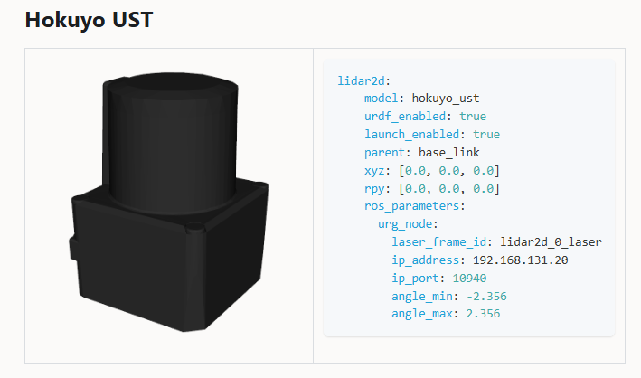
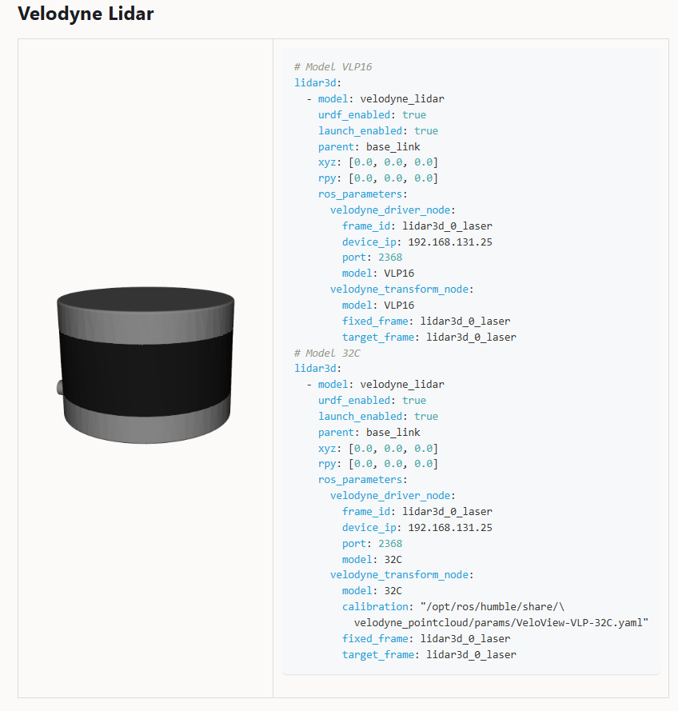
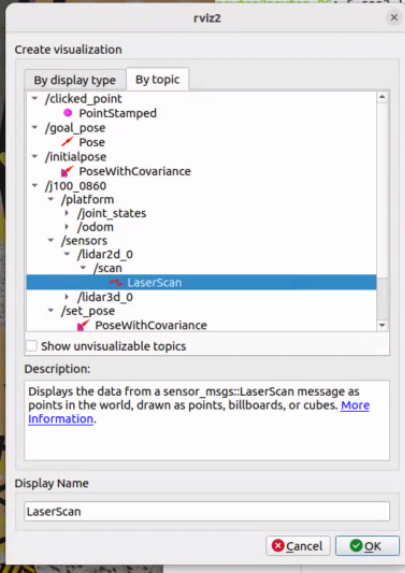
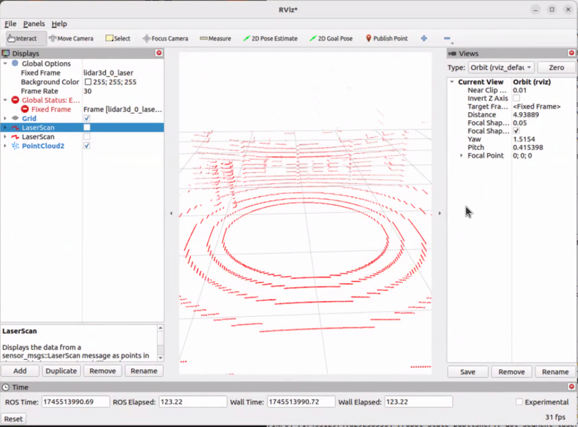

# ROS2 Notes
Dieter Steinhauser

Trevor Free

3/4/2025

University of Florida - Autonomous Robots


# Table of Contents

 - [Ubuntu 22.04 First Time Setup](#Ubuntu-22.04-first-time-setup)
 - [ROS2 Humble First Time Setup](#ROS2-Humble-First-Time-Setup)
 - [Project and Package Creation](#Project-and-Package-Creation)


# Ubuntu 22.04 First Time Setup

Update the system

```
sudo apt update && sudo apt upgrade -y
```

## Allow remote SSH connections
```
sudo apt install openssh-server
```

## Allow RDP connections
Configure the RDP settings in the GUI. You will also need to set the computer to never sleep or lock.

uncomment `waylandenable=False` in this file for RDP to work properly.
```
sudo nano /etc/gdm3/custom.conf
```

## Install the NVIDIA drivers
```
sudo apt remove --purge '^nvidia-.*'
sudo apt install ubuntu-drivers
sudo apt update && sudo apt upgrade -y

```

alternatives for the ubuntu drivers portion if the previous method did not work.
```
sudo apt install nvidia-driver
sudo apt install nvidia-utils
```

If all went well, reboot the machine
```
sudo reboot
```


# ROS2 Humble First Time Setup

https://docs.ros.org/en/humble/Installation/Ubuntu-Install-Debs.html


Before you start, perform a system update and upgrade. This will ensure that all packages are up-to-date.
```
sudo apt update && sudo apt upgrade -y
```

First ensure that the Ubuntu Universe repository is enabled.
```
sudo apt install software-properties-common
sudo add-apt-repository universe
```

Now add the ROS 2 GPG key with apt.
```
sudo apt update && sudo apt install curl -y
sudo curl -sSL https://raw.githubusercontent.com/ros/rosdistro/master/ros.key -o /usr/share/keyrings/ros-archive-keyring.gpg
```

Then add the repository to your sources list.
```
echo "deb [arch=$(dpkg --print-architecture) signed-by=/usr/share/keyrings/ros-archive-keyring.gpg] http://packages.ros.org/ros2/ubuntu $(. /etc/os-release && echo $UBUNTU_CODENAME) main" | sudo tee /etc/apt/sources.list.d/ros2.list > /dev/null
```


Update your apt repository caches after setting up the repositories.
```
sudo apt update && sudo apt upgrade -y
```

Desktop Install (Recommended): ROS, RViz, demos, tutorials.

```
sudo apt install ros-humble-desktop
```

Development tools: Compilers and other tools to build ROS packages
```
sudo apt install ros-dev-tools
```

have the setup script sourced on startup

```
sudo nano ~/.bashrc
```
Add the following line at the end of the file:
```
source /opt/ros/humble/setup.bash
```

# Project and Package Creation


## Folder Structure
Root 
-   Project 
    -    Build 
    -   Workspace (src) 
        -   Package 
            -   Node Files


## Folder Structure Example
AutonomousRobots 
-   HW3 (Project Workspace)
    -   Build 
    -   src (workspace packages)
        -   ar_hw3 (package)
            -   package.xml
            -   setup.cfg
            -   setup.py
            -   license

            -   turtle_spiral (Node Files)
                -   __init__.py
                -   turtle_spiral.py


### Create the Root, Project and Workspace folders, src is the standard workspace name


`cd <root-folder>`

`mkdir -p /<project_folder_name>/src`

### Create a package while in the Workspace src folder

`ros2 pkg create --build-type ament_python --license Apache-2.0 <desired-package-name>`

### Add your code to node files next to the __init__.py file in /package_name/package_name folder

# Add dependencies from code to package.xml

`<depend>[name_of_dependency]<depend>`

e.g. 

`<depend>std_msgs</depend>`

### add entry points to setup.py

`'<common_name> = package_name.node_file_name:function_name'`

e.g.

`'turtle_spiral = ar_hw3.turtle_spiral:main',`

### Check setup.cfg and see if there are any errors

### download dependencies at the workspace folder 
`rosdep install -i --from-path src --rosdistro humble -y`

## Build your package
`colcon build --packages-select <package_name>`


## How to Use the Package After Building

### Navigate to the project directory
`cd <project-name>`

### source package
`source install/setup.bash`

### run the node
`ros2 run <package_name> <node_file_name>`

e.g.  

`ros2 run ar_hw3 turtle_spiral`


## Extra Useful Commands

`lsusb`

`ros2 topic list`

`ros2 run turtlesim turtlesim_node`

### Turn on the usb_cam
`ros2 launch usb_cam camera.launch.py`

### Turn on the rqt image viewer to observe camera pre and post processing
`ros2 run rqt_image_view rqt_image_view`

### Turn on the face detector node that subscribes to the camera topic and publishes the computed data to a new topic.
`ros2 run ar_hw1 face_detector`


# Gazebo Fortress Installation

https://gazebosim.org/docs/fortress/install_ubuntu/

install some necessary tools
```
sudo apt-get update
sudo apt-get install lsb-release gnupg
```

install ingnition (gazebo) fortress
```
sudo curl https://packages.osrfoundation.org/gazebo.gpg --output /usr/share/keyrings/pkgs-osrf-archive-keyring.gpg
echo "deb [arch=$(dpkg --print-architecture) signed-by=/usr/share/keyrings/pkgs-osrf-archive-keyring.gpg] http://packages.osrfoundation.org/gazebo/ubuntu-stable $(lsb_release -cs) main" | sudo tee /etc/apt/sources.list.d/gazebo-stable.list > /dev/null
sudo apt-get update
sudo apt-get install ignition-fortress
```

All libraries and dependencies are installed. you can use gazebo by executing the following command.

```
ign gazebo
```

!!! NOTE NOTE

    Gazebo Fortress uses "ign gazebo" instead of "gz sim" to perform commands

# Gazebo Fortress First Time Run

```
gz sim shapes.sdf  # Fortress uses "ign gazebo" instead of "gz sim"
ign gazebo shapes.sdf 
```


# Installing the Clearpath Simulator

https://docs.clearpathrobotics.com/docs/ros/tutorials/simulator/install/

```
sudo apt-get update
sudo apt-get install ros-humble-clearpath-simulator
```

Create a workspace on the computer

- clearpath_ws
    - src

```
mkdir ~/clearpath_ws/src -p
```

Import Dependencies

```
source /opt/ros/humble/setup.bash
sudo apt install python3-vcstool
```

```
cd ~/clearpath_ws
```
cl
```
wget https://raw.githubusercontent.com/clearpathrobotics/clearpath_simulator/main/dependencies.repos
vcs import src < dependencies.repos
rosdep install -r --from-paths src -i -y
```

Build the packages 

```
colcon build --symlink-install
```

# Launching the Simulator

https://docs.clearpathrobotics.com/docs/ros/tutorials/simulator/simulate

```
ros2 launch clearpath_gz simulation.launch.py
```

Advertising Topic: 
```
j100_0860/cmd_vel
```

After populating the robot.yaml, we can launch gazebo  with the first command and control the movement of the jackal by using the `j100_0860/cmd_vel` topic. More details are provided below for configuring the robot and its attachments in the `robot.yaml` file.


# Configuring the Robot.yaml File

For a detailed explanation of the robot.yaml file, please refer to the [ROS Configuration Guide](https://docs.clearpathrobotics.com/docs/ros/config/yaml/overview), corresponding to the link below.

https://docs.clearpathrobotics.com/docs/ros/config/yaml/overview

 This `robot.yaml` file is located in the `clearpath' folder within the home directory. Below is the content of our robot.yaml file.

```
serial_number: j100-0860
version: 0
system:
  hosts:
    - hostname: cpr-j100-0860
      ip: 192.168.131.1
  ros2:
    namespace: j100_0860
    domain_id: 0                           
    middleware:
      implementation: rmw_fastrtps_cpp      #only supported option
platform:
  attachments:
    - name: front_fender
      type: j100.fender
    - name: rear_fender
      type: j100.fender 
      rpy: [0.0, 0.0, 3.1415]
  battery:
    model: HE2613
    configuration: S1P1

sensors:

  # Clearpath Camera Docs https://docs.clearpathrobotics.com/docs/ros/config/yaml/sensors/cameras 
  # Axis Camera Github Repo https://github.com/ros-drivers/axis_camera/tree/humble-devel
  camera: 
  - model: axis_camera   #need to get driver for this camera on github
    urdf_enabled: true   #need to set up urdf
    launch_enabled: true
    parent: base_link
    xyz: [0.15, 0.0, 0.18]
    rpy: [0.0, 0.0, 0.0]
    ros_parameters:
      axis_camera:
        device_type: q62

        hostname: "192.168.0.90"
        http_port: 80
        username: "root"
        password: ""
        camera_info_url: ""
        use_encrypted_password : False
        camera : 1

        width: 640
        height: 480
        fps: 20
        tf_prefix: "axis"

        ptz: True
        min_pan: -3.141592653589793
        max_pan: 3.141592653589793
        min_tilt: 0.0
        max_tilt: 1.5707963267948966
        min_zoom: 1
        max_zoom: 24
        max_pan_speed: 2.61
        max_tilt_speed: 2.61

        ptz_teleop: True
        button_enable_pan_tilt : -1
        button_enable_zoom     : -1
        axis_pan      : 3
        axis_tilt     : 4
        invert_tilt   : False
        axis_zoom_in: 5
        axis_zoom_out: 2
        zoom_in_offset: -1.0
        zoom_out_offset: -1.0
        zoom_in_scale: -0.5
        zoom_out_scale: 0.5
        scale_pan     : 2.61
        scale_tilt    : 2.61
        scale_zoom    : 100.0

        ir: False
        defog: False
        wiper: False

  # Model VLP16 https://docs.clearpathrobotics.com/docs/ros/config/yaml/sensors/lidar3d
  # 3D Lidar Bitbucket Repo https://bitbucket.org/DataspeedInc/velodyne_simulator/src/ros2/

  lidar3d:
  - model: velodyne_lidar
    urdf_enabled: true
    launch_enabled: true
    parent: base_link
    xyz: [-0.15 , 0.0, 0.18]
    rpy: [0.0, 0.0, 0.0]
    ros_parameters:
      velodyne_driver_node:
        frame_id: lidar3d_0_laser
        device_ip: 192.168.131.25
        port: 2368
        model: VLP16
      velodyne_transform_node:
        model: VLP16
        calibration: "/opt/ros/humble/share/\
          velodyne_pointcloud/params/VLP16db.yaml"
        fixed_frame: lidar3d_0_laser
        target_frame: lidar3d_0_laser

 # Clearpath Docs for 2D Lidar https://docs.clearpathrobotics.com/docs/ros/config/yaml/sensors/lidar2d
 # 2D Lidar Github Repo https://github.com/ros-drivers/urg_node

  lidar2d:
  - model: hokuyo_ust
    urdf_enabled: true
    launch_enabled: true
    parent: base_link
    xyz: [0.15, 0.1, 0.19]
    rpy: [0.0, 1.57, 0.0]             #angle in radians
    ros_parameters:
      urg_node:
        laser_frame_id: lidar2d_0_laser
        ip_address: 192.168.131.20
        ip_port: 10940
        angle_min: -2.356
        angle_max: 2.356

```
## Serial Number
The Clearpath serial number is composed of two sections, separated by a hyphen. For example, A Jackal `j100-0000` has an alpha-numerical code for the robot platform `j100` and a unit number `0000`.

Every robot platform has specific attachments that are selected based on the serial number passed. Therefore, it is required that a serial number is specified in the robot.yaml.

## Sensors 

Clearpath has been migrating a large number of sensors from ROS1 to ROS2, and the documentation is still evolving. The overview of the sensors can be found here:

  https://docs.clearpathrobotics.com/docs/ros/config/yaml/sensors/overview


Clearpath seems to handle most of the sensor driver support for the Jackal. As long as the sensor is available in their documentation and configured in the robot.yaml, it should as soon as gazebo is launched. Below are the sensors we chose to use, links and notes for their drivers.


### Cameras

  Clearpath Camera Docs https://docs.clearpathrobotics.com/docs/ros/config/yaml/sensors/cameras 

  Axis Camera Github Repo https://github.com/ros-drivers/axis_camera/tree/humble-devel
  camera: 

### 2D Lidar



 Clearpath Docs for 2D Lidar https://docs.clearpathrobotics.com/docs/ros/config/yaml/sensors/lidar2d

 2D Lidar Github Repo https://github.com/ros-drivers/urg_node

 !!! Note Note

    These commands do not seem to be necessary to run in parallel with the clearpath.

 `ros2 run tf2_ros static_transform_publisher --frame-id world --child-frame-id laser`

 `ros2 run robot_state_publisher robot_state_publisher /home/newton/clearpath_ws/src/urg_node/launch/hokuyo_laser.urdf`

### 3D Lidar

  Model VLP16 https://docs.clearpathrobotics.com/docs/ros/config/yaml/sensors/lidar3d

  

  3D Lidar Bitbucket Repo https://bitbucket.org/DataspeedInc/velodyne_simulator/src/ros2/

# Bridge

`ros2 run bridge bridge`

# Interacting With Sensors in Rviz

Launch Rviz2 with the following command

`rviz2`

In Rviz, you can add a sensor by selecting `Add` from the menu bar, then sort by `topic`. You can then select the type of sensor you want to add and configure it according to your needs. If you have configured the clearpath robot.yaml correctly, you should be able to see the sensors in Rviz.



We then need to add a frame of reference for Rviz. We can do this by selecting `Fixed Frame` from the menu bar. You can then use the dropdown to select a frame of reference that matches your robot's frame of reference or write in the frame of reference corresponding to the sensor you are interested in. 

For example, if you are using a Hokuyo 2D Lidar, you can select `lidar3d_0_laser` as your fixed frame. Once you have selected the fixed frame, you should be able to see the sensors data in Rviz.



# Bridging Sensors and Actuators

For a quick demo, we decided to implement a circular motion for our robot by having a node publish to the `j100_0860/cmd_vel` topic. During this process, we observed the sensor data in Rviz to visualize the surrounding environment.

